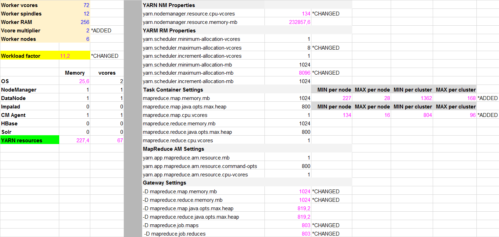

#YARN/RM Lab: Doing the Math

_Motivation: My goal was to identify maximum number of containers that could run in parallel during terasort and teragen tests._
**Lab assumptions:**
- No more than one MR job will run at any time (FIFO scheduler style :) )
- Settings are optimized for artificial teragen tests only
- I assume that value in Worker vcores represent physical cores

## Changes to calculation sheet

*Values/Formulas I changed are marked as CHANGED*

*Values/Formulas I added are marked as ADDED*

- **Vcore multiplier:** I added vcore multiplier to calculate yarn.nodemanager.resource.cpu-vcores. This could be higher than number of physical cores and some workloads may benefit from it.
- **Workload factor:** I changed original static field to calculated value that show number of vcores per one spindle. Formula: yarn.nodemanager.resource.cpu-vcores / Worker spindles.
- **yarn.nodemanager.resource.cpu-vcores:** I changed formula to product of Vcore multiplier and YARN vcores. I will assign all cores not used by other applications to YARN.
- **yarn.scheduler.maximum-allocation-vcores:** I slightly increased this to 8. I.e. Spark may benefit from more cores per executor.  
- **yarn.scheduler.maximum-allocation-mb:** I added cap of 8096m to original formula. It is not a good idea to allow users to allocate huge amount of RAM per one container.
- **MIN/MAX per node/cluster:** I added extra calculation to show what is the number of containers when using MIN and MAX allowed settings for vcores and RAM. In my case that is between 96 containers (when using 8 vcores per container) and 804 containers (when using single vcore per container).
- **-D mapreduce.map.memory.mb:** I changed this value to yarn.scheduler.minimum-allocation-mb. In my experience teragen/terasort work fine with 1024m (when using reasonable block size and compression).
- **-D mapreduce.reduce.memory.mb:** Same as previous...
- **-D mapreduce.job.maps:** Changed calculation to Maximal containers per cluster (-1 for application master). This will only work for teragen because terasort will have as many mappers as there are input blocks.
- **-D mapreduce.job.reduces:** Changed calculation to Maximal containers per cluster (-1 for application master). This will only work for terasort because teragen is map only operation. 
  
## Workload explanation

804 containers could run in parallel on given cluster.

Vcores per spindle ratio is very high and any write heavy tasks like Teragen will probably end with CPU stuck at io_wait.

This setup may work much better for computation tasks (deep learning, simulations, etc.).

  
