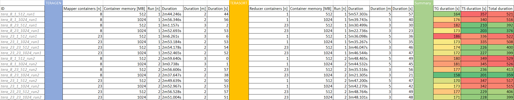
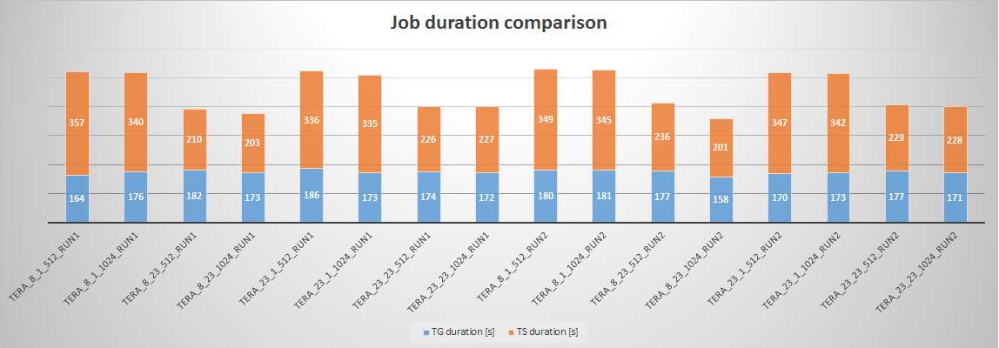

# Fastest and slowes job runs

## YARN setup
On my limited aws nodes I was able to use 8 vcores and 8 GB of RAM per Node Manager.

## Performance evaluation
My script iterated over combinations of the following settings:
- Reducer containers: 1, 23
- Mapper containers: 8, 23
- Container memory: 512, 1024

The test cases:

## Results:

*The fastest job:* 
- Teragen _(ignoring reduce settings)_
 - Mapper containers [n]: 8 _(+1 application master)_
 - Mapper container size [MB]: 1024 _(820m heap size)_
 - Teragen duration [s]: 158
- Terasort _(ignoring mapper count settings, because 92 mappers run for each job)_
 - Reducer containers [n]: 23 _(+1 application master)_
 - Reducer container size [MB]: 1024 _(820, heap size)_
 - Terasort duration [s]: 201

*The slowest job:*
- Teragen _(ignoring reduce settings)_
 - Mapper containers [n]: 8 _(+1 application master)_
 - Mapper container size [MB]: 512 _(409m heap size)_
 - Teragen duration [s]: 180
- Terasort _(ignoring mapper count settings, because 92 mappers run for each job)_
 - Reducer containers [n]: 1 _(+1 application master)_
 - Reducer container size [MB]: 512 _(409m, heap size)_ 
 - Terasort duration [s]: 349